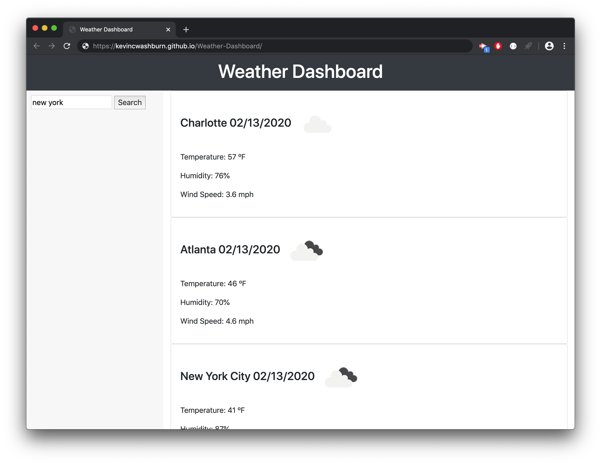

# Weather-Dashboard

This repository contains a web-based weather dashboard that allows the user to type in the name of a city and get real-time weather information of that city. Each city that is entered is displayed on the right-hand side of the page that shows the current date, a weather icon showing the current weather conditions, as well as the current temperature in fahrenheit, humidity level, and wind speed. Each additional city is displayed below the previous one.

Link to Deployed Site:
https://kevincwashburn.github.io/Weather-Dashboard/

Screenshot:

